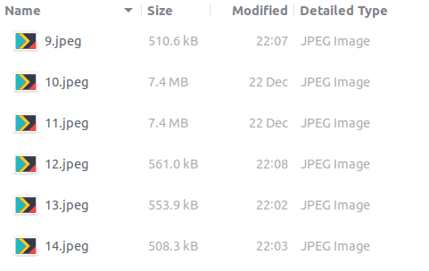
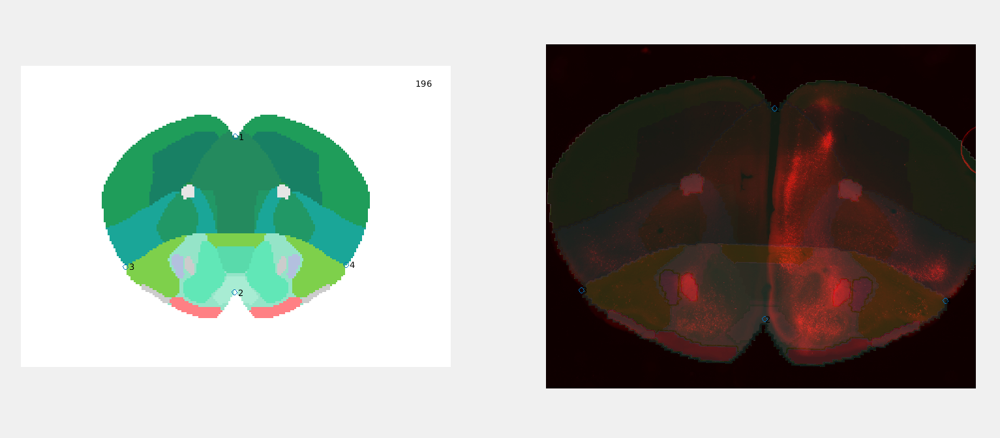
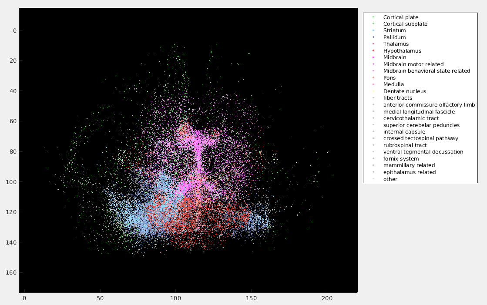
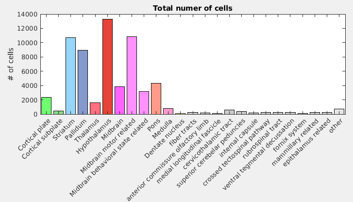

# Handy Automated Neuroexplorer
Handy Automated Neuroexplorer (HAN) is a set of MATLAB scripts to quickly and conveniently align microscopy data with the Allen Brain Atlas and quantify the number of cells per brain region. It can be run on any number of coronal brain sections.

##Design Philosophy
The basic philosophy behind HAN was ***not*** to make a fully automated histology analyzer but instead to produce a robust set of scripts that can be used to ***analyze one mouse brain in ~1h***. It does so by combining automated with manual processes and by simplifying several aspect of the pipeline.

There are several packages available to align microscopy data with an atlas. However we found that many of these packages are over-engineered and prone to bugs. Often the emphasis in on slick imagery vs robust quantifiable results. Depending on the quality of the histological preparation, semi-automated analysis can actually be fairly simple. There is no need for computer vision or advanced machine learning protocols. Indeed, we've found previously that simply counting the number of pixels above a threshold gives a very decent estimation of cell count [[1](https://www.cell.com/neuron/fulltext/S0896-6273(18)30996-6)][[2](https://www.nature.com/articles/s41467-019-12392-2.epdf?author_access_token=OTxeJ8_qgQp7v15u8BSA-tRgN0jAjWel9jnR3ZoTv0MUneVmJ4JH_O4MtE_acWSNYWKZs7QVtUfh3QOhoI6FI9zFH_WL7YKGvDhKiJdYxr5_DnR7095snSO4y6eceWinSWeAJWWjwRchhSWbd-tqOQ%3D%3D)]. Here we use simple 2D convolution for cell identification. 

###Increased Efficiency vs Limitations
- There is no GUI. Instead the user works trough a MATLAB 'Live Script', or uses the included functions to write their own code.
- The reference atlas can only be fitted [via standard matrix manipulations](https://www.youtube.com/watch?v=kYB8IZa5AuE) (resizing, translation, rotation & shearing).
- Cells are recognized via simple 2D convolution.

###Example data included in this repository
- 5 coronal example slices of varying quality, including some tissue damage and slight over exposure in 1 section.
- A .txt. file containing identified cells in one mouse brain to pilot the 3D plotting procedure and colormap. 

##Basic Work Flow
The basic work flow is explained in a MATLAB live script, it is also possible to run the individual functions yourself.

1. Store numbered microscopy images in a folder. Currently HAN only supports coronal sections. It's tested on tiling 4000 X 5000pxl images taken with a Zeis M2 microscope.

2. Align sections to the atlas using ...

3. Identify cells via 2D convolution using AIDA Histo (adapted from ...)

4. Transform and merge ...

##Results
Final results is a .txt file with coordinates (X, Y & Z) of cells mapped to the reference atlas. For each cell an identifier (ID, see below) is included that represents a specific brain region.

##Source Material
- AIDA*histo* written by Niklas Pallast & Markus Aswendt: https://github.com/maswendt/AIDAhisto. An adapted version based on the AIDA*histo* code from june 2019 is included in this repository and used for the 2D convolution procedure. Please see their Github profile for newer version (as well as a Python version), a detailed [manual](https://github.com/maswendt/AIDAhisto/blob/master/manual.pdf) and a method for aligning microscopy data to the Allen Brain Atlas that does not involve Matlab, but uses ImageJ instead. 
- Allen Brain Atlas: http://atlas.brain-map.org/

## FAQ

***Why write HAN in MATLAB, while Python is a superior language?***
Although Python has many advantages, MATLAB use is still ubiquitous in the neuroscience community. MATLAB also has several build-in function that make working with microscopy data very convenient. That being said, you should totally go ahead making a Python version of these scripts. It's a fairly straightforward matter to segment cells (2D convolution and thresholding) and align them to the data (matrix transformation based on markers) using OpenCV and NumPy.

